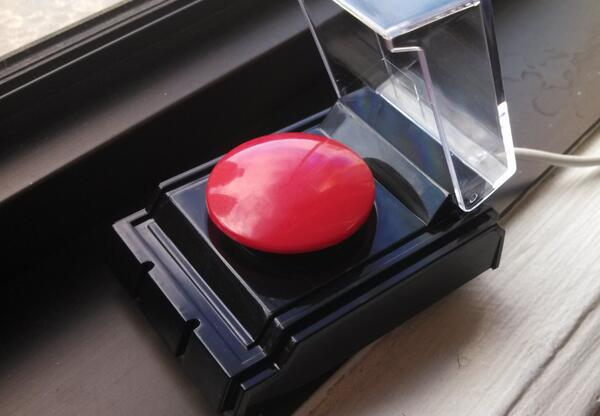

Go Deploy with Big Red Button
=============================

The [Dream Cheeky](http://www.dreamcheeky.com/big-red-button) Big Red button is a USB device.

This app lets you use it to trigger a [Go.CD](http://go.cd) pipeline.

   > bundle

   > cp config.yml{.example,}

Edit your config.yml to match your usage.

   > ruby main.rb

I only have this working on OSX for now.  Attempts at running it on Vagrant for use on Windows encountered a Ruby C Library bug :-(
